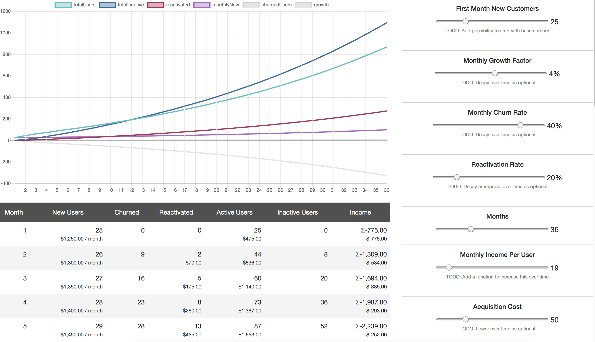

# SaaS Churn, Reactivation, Growth Calculator

[](https://app.netlify.com/sites/saas-revenue-calculator/deploys)

[DEMO](https://saas-revenue-calculator.netlify.com/)

Built with Create React App - Styles from Bootstrap 4



## Get Started

```
npm install
npm start
```

Go to [http://localhost:3000](http://localhost:3000) and drag the sliders.

## Resources

https://en.wikipedia.org/wiki/Churn_rate
